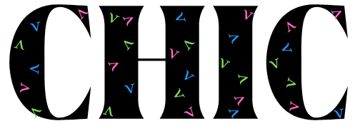

# CHIC

C++ library for computing three/flavor neutrino oscillation probabilities and their derivatives.

## Structure

- `src/`: C++ source and headers
- `bindings/`: Python package and bindings
- `tests/`: Tests for C++ and Python

## Requirements

- Eigen library: https://libeigen.gitlab.io/?title=Main_Page
- Only if building python bindings:
	- pybind11: https://pybind11.readthedocs.io/en/stable/installing.html
	- numpy: https://numpy.org/install/

## Build instructions

- For the CHIC library
```
make clean
make 
```
or 
```
make lib
```

- For the python bindings (optional)
```
pip install ./bindings
```
